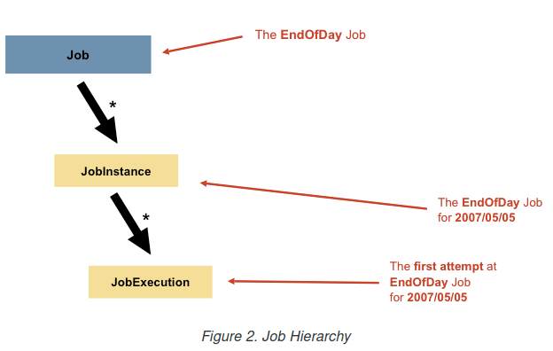
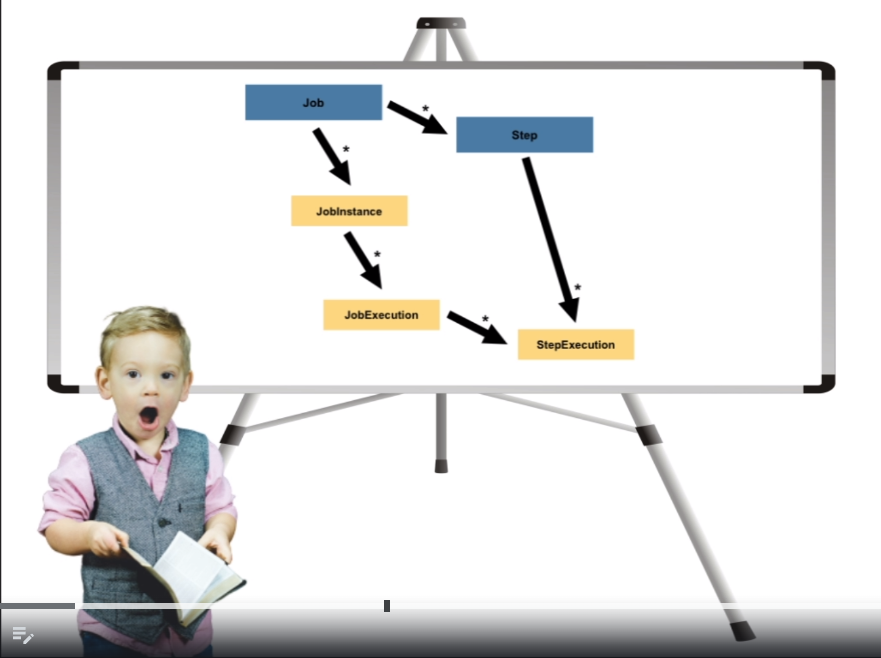
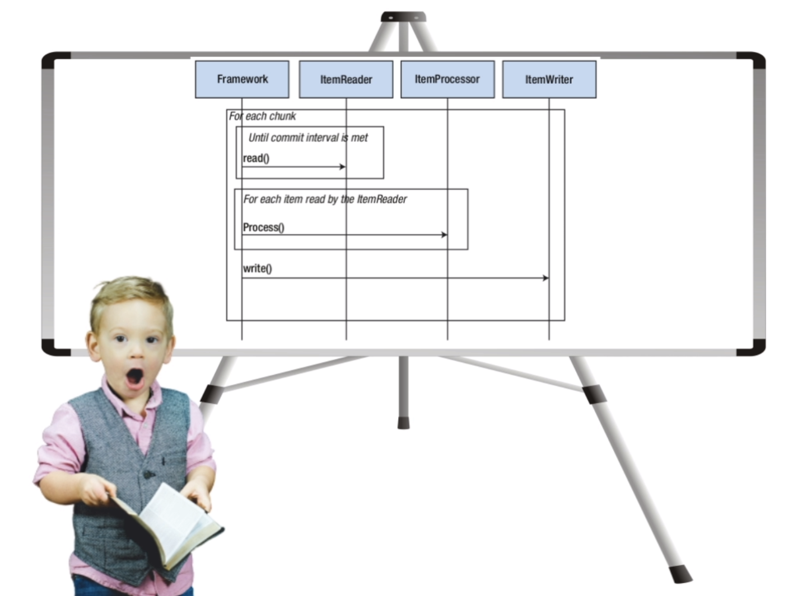
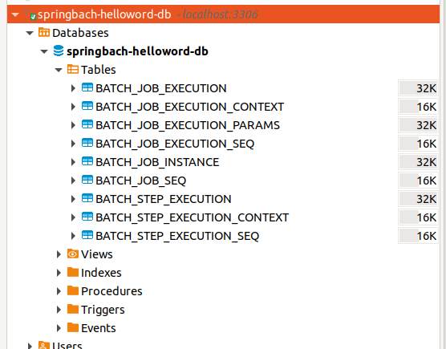
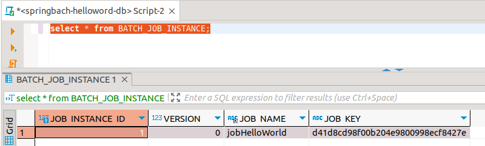
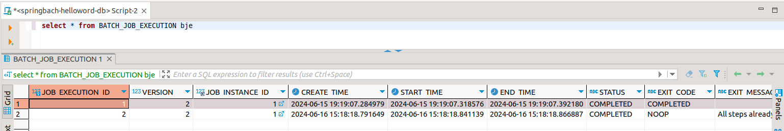
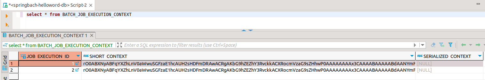
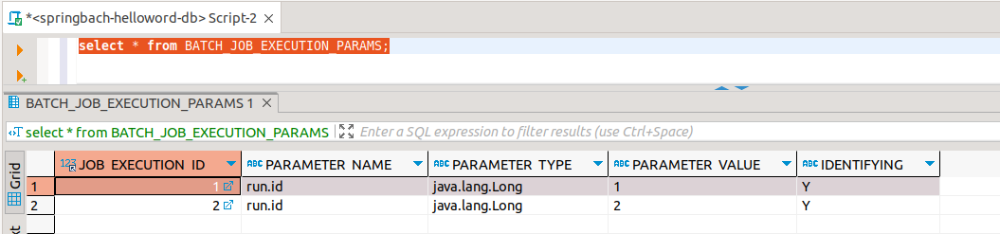
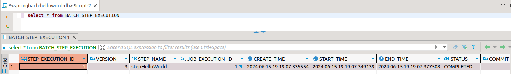
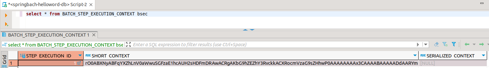

# Spring Batch
is an open source framework for batch processing. It is a lightweight, comprehensive solution designed to enable the development of robust batch applications, which are often found in modern enterprise systems. Spring Batch builds upon the POJO-based development approach of the Spring Framework.
[reference](https://docs.spring.io/spring-batch/reference/spring-batch-intro.html)

## JOB
This section describes stereotypes relating to the concept of a batch job. A Job is an entity that encapsulates an entire batch process. As is common with other Spring projects, a Job is wired together with either an XML configuration file or Java-based configuration. This configuration may be referred to as the “job configuration”. However, Job is only the top of an overall hierarchy, as shown in the following diagram:


n Spring Batch, a Job is simply a container for Step instances. It combines multiple steps that logically belong together in a flow and allows for configuration of properties global to all steps, such as restartability. The job configuration contains:

    - The name of the job.
    - Definition and ordering of Step instances.
    - Whether or not the job is restartable.


* Job is defined by a chained sequence of steps, and each step has its own logic


**StepExecution:** To maintain the self-contained state. Which represents a physical execution of the step associated with a physical execution of the job, to facilitate monitoring, analyze the execution and restart of the JOB   

The way in which the step defines its logic categorizes it as a **Tasklet** or **Chunk** type
- **Tasklet** - They are used for simple processing, generally for preprocessing tasks where they need a single command to execute. Example cleaning files, creating directories, etc... 
- **Chunk** - They are used for more complex processing, which needs to be carried out in pieces. These pieces are divided into **ItemReader**, **ItemProcessor** and **ItemWriter** each one has its transaction  

### Chunk flow

### Guides

The following guides illustrate how to use some features concretely:

* [Creating a Batch Service](https://spring.io/guides/gs/batch-processing/)


### METADADOS

- Property that makes spring create the metadata tables   
```
spring:
  batch:
    jdbc:
      initialize-schema: always
```



JOB 
------------------------------------------------------------------------------------------------------

- Table that shows the number of logical executions of this bach, successful execution! 
```
select * from BATCH_JOB_INSTANCE;
```


------------------------------------------------------------------------------------------------------

- Table showing the total amount of execution (Success or failure)!
```
select * from BATCH_JOB_EXECUTION;
```



------------------------------------------------------------------------------------------------------

- Table that shows what data was saved in the JOB! execution context. Here we can place additional information that is important to help us understand the logic of executing the job!  
```
select * from BATCH_JOB_EXECUTION_CONTEXT;
```



------------------------------------------------------------------------------------------------------

- Table showing the JOB! execution parameters.
```
select * from BATCH_JOB_EXECUTION_PARAMS;
```



STEP
------------------------------------------------------------------------------------------------------
- Table showing steps performed!
```
select * from BATCH_STEP_EXECUTION;
```



------------------------------------------------------------------------------------------------------

- Table that shows specific steps information, with execution logic!
```
select * from BATCH_STEP_EXECUTION_CONTEXT
```

- 

### Scripts for delete  metadados
```
delete from BATCH_JOB_EXECUTION_SEQ;
delete from BATCH_JOB_EXECUTION_PARAMS;
delete from BATCH_JOB_EXECUTION_CONTEXT;

delete from BATCH_STEP_EXECUTION_SEQ;
delete from BATCH_STEP_EXECUTION_CONTEXT;
delete from BATCH_STEP_EXECUTION;

delete from BATCH_JOB_SEQ;
delete from BATCH_JOB_EXECUTION;
delete from BATCH_JOB_INSTANCE;
```

